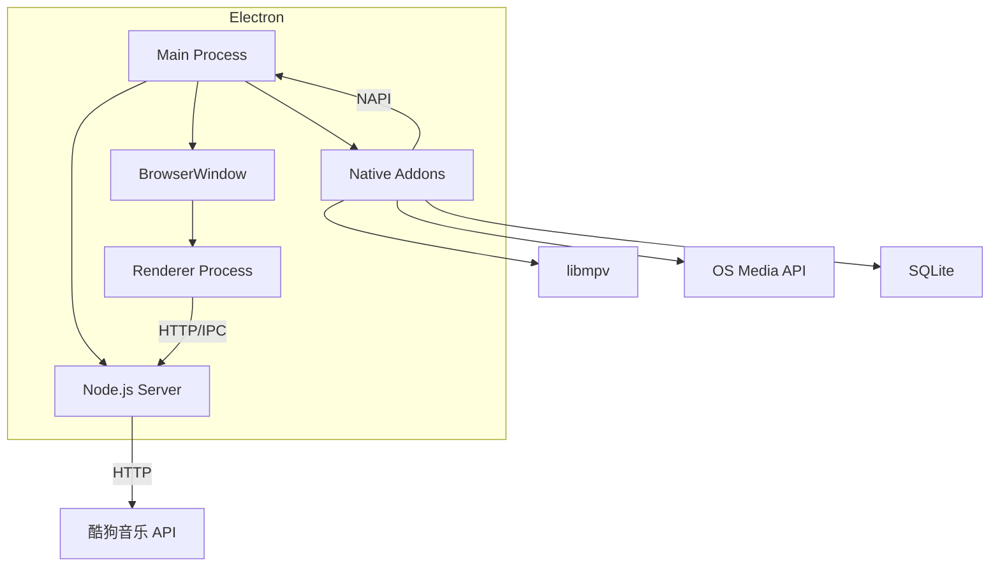
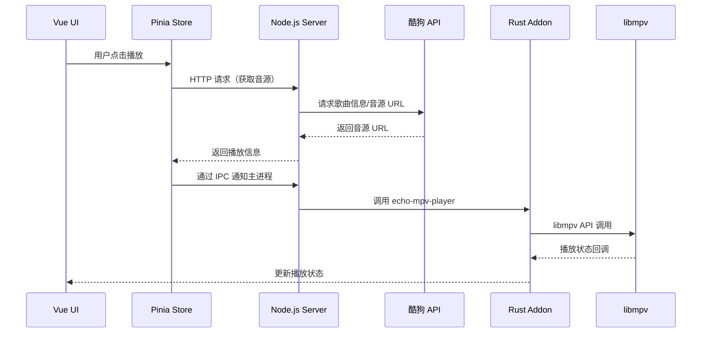
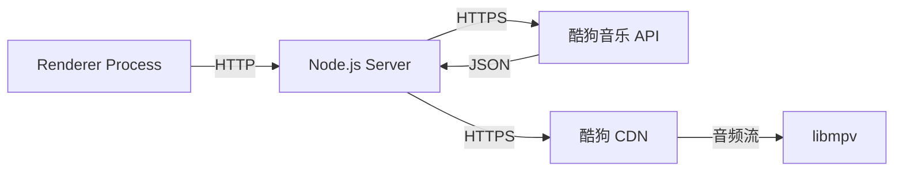
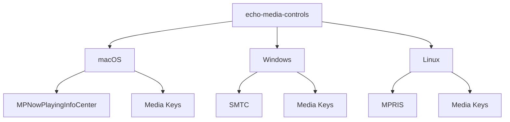

# 🏗️ 项目架构

本文介绍 EchoMusic 的整体架构设计，包括进程模型、数据流和核心组件。

## 进程模型

EchoMusic 基于 Electron 的多进程架构：

### Main Process（主进程）

运行在 Node.js 环境中，负责：

- 创建和管理 BrowserWindow
- 调用原生模块（Rust NAPI addons）
- 启动内置 HTTP 服务器（Node.js）
- 系统托盘管理
- 开机自启动管理
- 应用生命周期管理
- 自动更新检测

### Renderer Process（渲染进程）

运行在 Chromium 环境中，负责：

- Vue 3 UI 渲染
- 用户交互处理
- 状态管理（Pinia）
- 通过 HTTP/IPC 与主进程通信

## 音频播放管线

EchoMusic 的音频播放是最核心的链路：

### 核心播放器架构

`echo-mpv-player` 是播放引擎的核心封装：

- 直接调用 libmpv C API
- 支持淡入淡出、EQ 均衡器
- 音量均衡（LUFS 标准化）
- 播放事件回调（进度、状态变化等）

## 数据流

### 状态管理

使用 Pinia 进行全局状态管理，配合 `pinia-plugin-persistedstate` 实现状态持久化：

| Store | 职责 |
|-------|------|
| `playerStore` | 播放状态、队列、模式、进度 |
| `userStore` | 用户登录状态、用户信息 |
| `settingsStore` | 应用设置、偏好配置 |
| `searchStore` | 搜索关键词与结果 |

状态通过 SQLite（`echo-storage`）实现本地持久化。

### 网络请求

1. UI 发起请求到内置 Node.js Server
2. Server 调用酷狗音乐公开 API
3. Server 处理数据并返回给 UI
4. 音频流直接传递给 libmpv 解码播放

## 系统集成架构

`echo-media-controls` 模块实现各平台系统集成：

## 安全设计

- 账号密码只在登录时传递，不本地存储明文密码
- 所有 API 请求通过 HTTPS 加密
- 本地数据存储在用户目录的隔离空间中
- 不收集、不上传用户个人信息