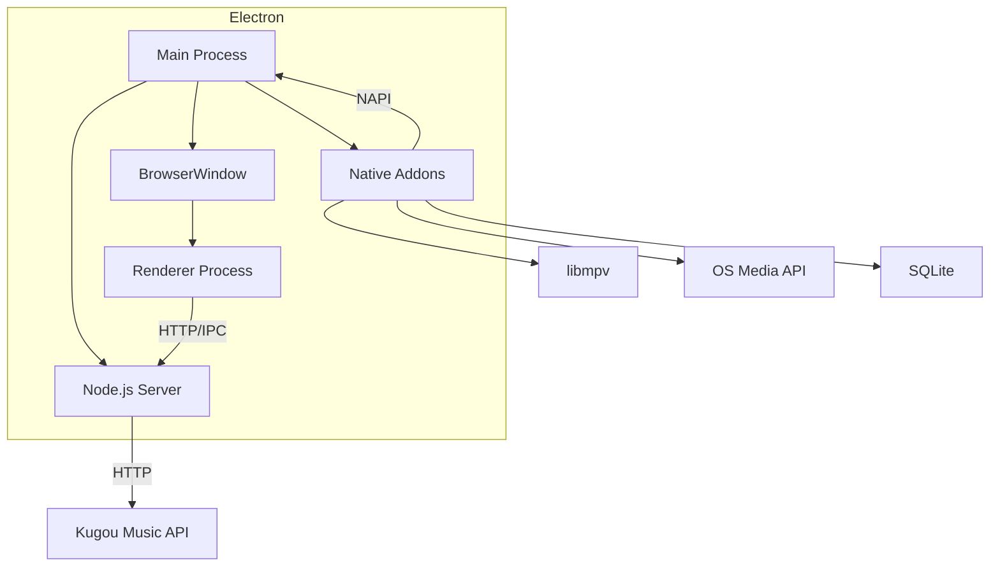
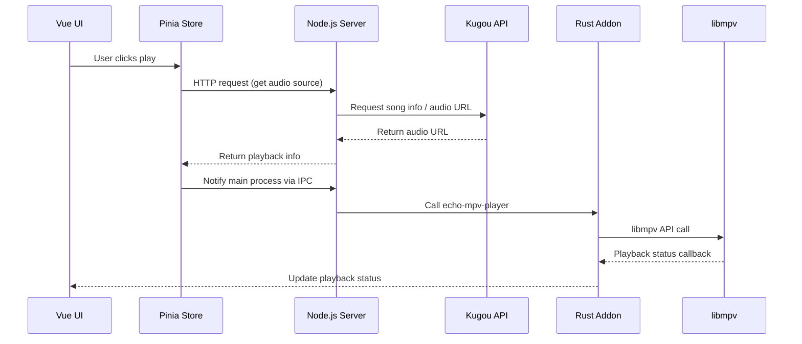
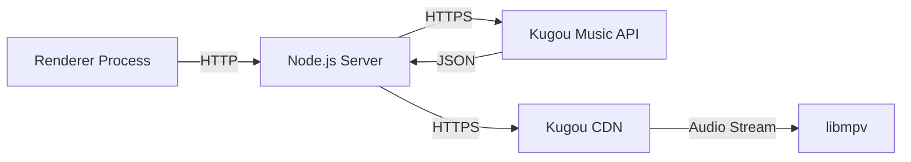
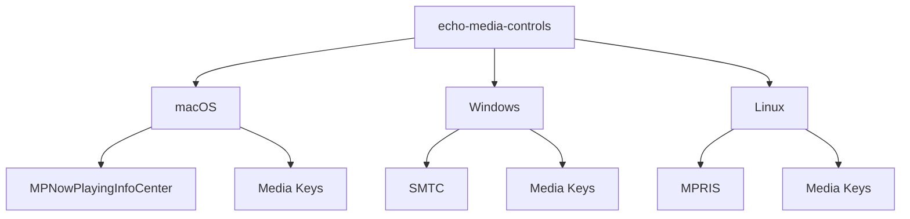

# 🏗️ Architecture

This document describes EchoMusic's overall architecture design, including the process model, data flow, and core components.

## Process Model

EchoMusic is based on Electron's multi-process architecture:

### Main Process

Runs in the Node.js environment, responsible for:

- Creating and managing BrowserWindow
- Invoking native modules (Rust NAPI addons)
- Starting the built-in HTTP server (Node.js)
- System tray management
- Auto-start management
- Application lifecycle management
- Automatic update detection

### Renderer Process

Runs in the Chromium environment, responsible for:

- Vue 3 UI rendering
- User interaction handling
- State management (Pinia)
- Communicating with the main process via HTTP/IPC

## Audio Playback Pipeline

EchoMusic's audio playback is the core pipeline:

### Core Player Architecture

`echo-mpv-player` is the core wrapper of the playback engine:

- Directly calls the libmpv C API
- Supports crossfade, EQ equalizer
- Volume normalization (LUFS standardization)
- Playback event callbacks (progress, status changes, etc.)

## Data Flow

### State Management

Uses Pinia for global state management, with `pinia-plugin-persistedstate` for state persistence:

| Store | Responsibility |
|-------|------|
| `playerStore` | Playback status, queue, mode, progress |
| `userStore` | User login status, user info |
| `settingsStore` | Application settings, preferences |
| `searchStore` | Search keywords and results |

State is persisted locally via SQLite (`echo-storage`).

### Network Requests

1. UI sends requests to the built-in Node.js Server
2. Server calls Kugou Music's public API
3. Server processes data and returns it to the UI
4. Audio stream is directly passed to libmpv for decoding and playback

## System Integration Architecture

The `echo-media-controls` module implements platform-specific system integration:

## Security Design

- Account passwords are only transmitted during login — no plaintext passwords stored locally
- All API requests use HTTPS encryption
- Local data is stored in an isolated space within the user directory
- No user personal information is collected or uploaded